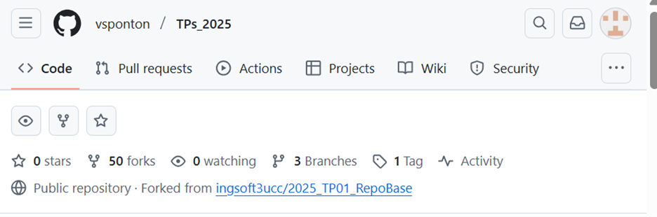
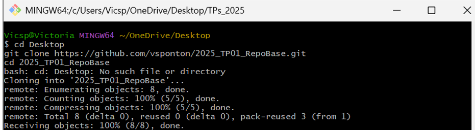
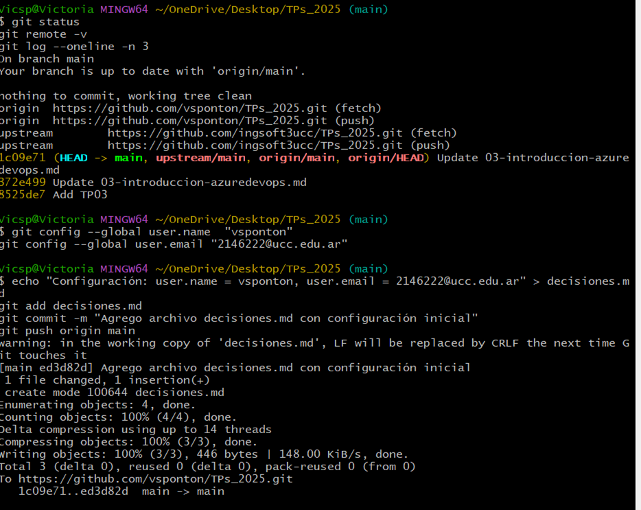
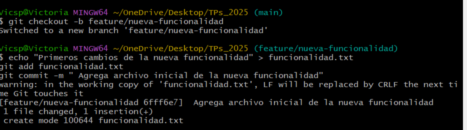
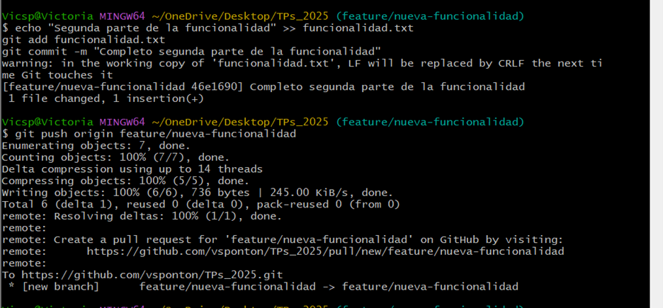
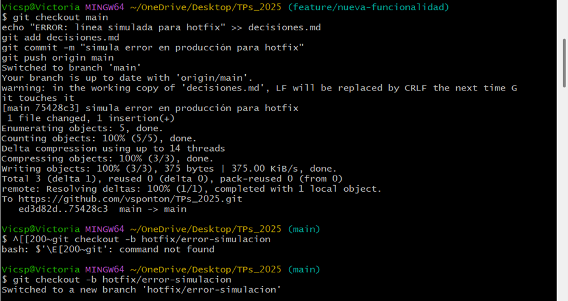
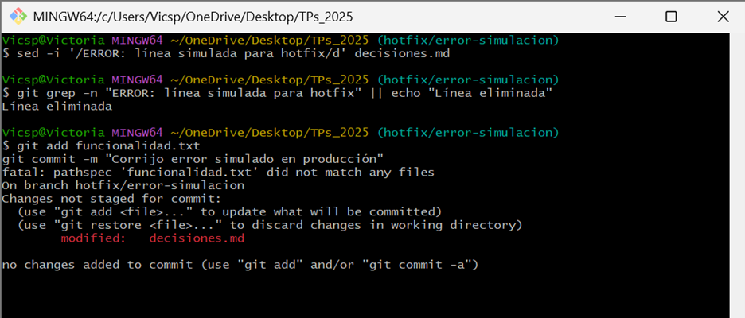
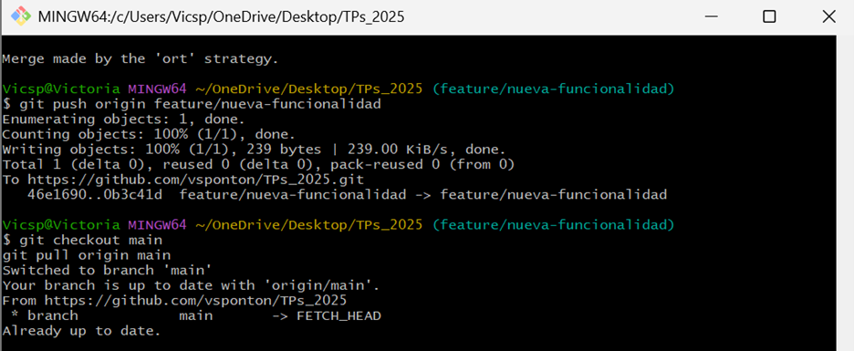
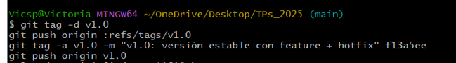

# Decisiones del TP01 — Git Básico (2025)

### Antes de empezar  (repo y remotos)
- `cd ~/OneDrive/Desktop`
- `git clone https://github.com/vsponton/TPs_2025.git`
- `cd TPs_2025`
- `git remote add upstream https://github.com/ingsoft3ucc/TPs_2025.git`
- `git remote -v`

**(Caso especial que me pasó)**  
Al sincronizar con el repo original apareció *“refusing to merge unrelated histories”*. Lo resolví así:
- `git checkout -b backup/pre-sync-TPs_2025`     # respaldo
- `git checkout main`
- `git fetch upstream`
- `git reset --hard upstream/main`
- `git push -u origin main --force`               # alinear mi fork con upstream

> Nota Windows/OneDrive: si `git clean -fdx` no borra carpetas por permisos, usé PowerShell:  
> `powershell -NoProfile -Command "Remove-Item -LiteralPath './carpeta' -Recurse -Force"`

---
# Pasos Realizados

---

## 1. Forkeamos el repo

---

## 2. Clone al repo

---

## 3. Realizamos la configuración inicial

---

## 4. Creamos la rama secundaria y el primer commit atómico

---

## 5. Segundo commit atómico

---

## 6. Simulamos un error y creamos la rama hotfix para corregirlo

---

## 7. Solucionamos el error en la rama hotfix

---

## 8. Integramos la rama hotfix y la feature a main

---

## 9. Creación y push del tag

## Comandos de chequeo
- `git log --oneline --graph --decorate -n 20`
- `git log --oneline origin/main..origin/feature/nueva-funcionalidad`
- `git tag -l -n1`
- `git show --no-patch --oneline v1.0`

