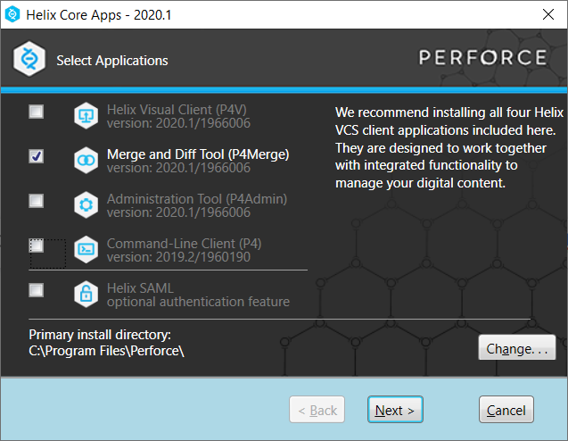

# ⚠️ IMPORTANTE – Guía de Práctica Sugerida

Lo que vas a ver a continuación es una **guía paso a paso altamente sugerida** para que practiques el uso de Git.  
**Te recomendamos hacerla completa**, ya que te ayudará a adquirir los conocimientos necesarios.

---

## PERO: Esta guía **NO es el trabajo práctico** que tenés que entregar

El trabajo práctico será evaluado en base a:
- Tu capacidad para **organizar tu trabajo en Git con criterio técnico**.
- Tu capacidad para **explicar y justificar cada decisión que tomaste**.
- Una **defensa oral obligatoria** donde vas a tener que demostrar lo que sabés.

---

## ¿Dónde está el trabajo práctico?

El **TP real que debés entregar y defender** se encuentra al final de este archivo.  
No alcanza con copiar esta guía. **Si no podés defenderlo, no se aprueba.**

---

## Sobre esta guía

- Esta guía NO es exhaustiva.
- Git es una tecnología que requiere **investigación y práctica fuera de clase**.
- En 2 horas no vas a aprender Git completo. **Esto es solo el punto de partida.**

---

# Introducción a Git

Git es un sistema de control de versiones distribuido ampliamente utilizado en el desarrollo de software y proyectos colaborativos. Fue creado por Linus Torvalds en 2005 y se basa en la eficiencia, flexibilidad y velocidad para rastrear cambios en archivos y coordinar el trabajo en equipo.

Es una herramienta poderosa y esencial para el desarrollo de software. Su enfoque distribuido permite que cada usuario tenga una copia completa del repositorio, lo que facilita el trabajo independiente y la colaboración eficiente.

## Estados de Git

- **Working Directory**: Archivos en el sistema de archivos.
- **Staging Area**: Área de preparación para los commits.
- **Repository**: Historial de commits local.
- **Remote Repository (GitHub)**: Repositorio remoto con los mismos tres estados internos.

## Instalación de Git

- **Windows**: [Git for Windows](https://git-for-windows.github.io/)
- **Mac OS**: Git ya viene instalado; verificar con `git version` en Terminal.

## Configuración de Editor

### Windows: Notepad++
- Crear alias en Git Bash: `alias npp='notepad++.exe -multiInst -nosession'`
- Configurar como editor predeterminado:
  ```bash
  git config --global core.editor "notepad++.exe -multiInst -nosession"
  ```

### Mac: TextMate
- Instalar desde [https://macromates.com/](https://macromates.com/)
- Configurar como editor predeterminado:
  ```bash
  git config --global core.editor "mate -w"
  ```

## Principales Conceptos de Git

- **Repositorio**: Almacén de archivos e historial.
- **Commit**: Conjunto de cambios en un momento específico.
- **Branch (Rama)**: Línea de desarrollo independiente.
- **Merge (Fusión)**: Combina cambios entre ramas.
- **Clone**: Copia completa de un repositorio remoto.

## Comandos Básicos de Git

```bash
git init               # Inicializa un repositorio local
git clone [URL]        # Clona repositorio remoto
git add [archivo]      # Prepara archivo para commit
git commit -m "msg"    # Crea un nuevo commit
git status             # Estado del repositorio
git log                # Historial de commits
git push               # Envía commits al remoto
git pull               # Trae y fusiona cambios remotos
git branch             # Lista ramas
git merge [rama]       # Fusiona rama indicada
```

---

# Guía Paso a Paso – Git Básico (Práctica sugerida)


## Guia Práctica 1 - Git Básico

### 1- Objetivos de Aprendizaje
 - Utilizar herramientas de control de configuración de software
 - Familiarizarse con los comandos más utilizados
 - Configurar el repositorio principal de cada alumno para la materia

### 2- Unidad temática que incluye este trabajo práctico
Este trabajo práctico corresponde a la unidad Nº: 1

### 3- Consignas a desarrollar:
  - Los ejercicios representan casos concretos y rutinarios en uso de este tipo de herramientas
  - En los puntos donde corresponda, proveer los comandos de git necesarios para llevar a cabo el punto.
  - Cuando se especifique alguna descripción, realizarlo de la manera más clara posible y con ejemplos cuando sea necesario.

### 4- Desarrollo:

#### 1- Instalar Git
Los pasos y referencias asumen el uso del sistema operativo Windows, en caso otros SO seguir recomendaciones específicas.

  - Bajar e instalar el cliente git. Por ejemplo, https://git-for-windows.github.io/
  - Bajar e instalar un cliente visual.
 Por ejemplo, TortoiseGit para Windows o SourceTree para Windows/MAC:
    - https://tortoisegit.org/
    - https://www.sourcetreeapp.com/
    - Lista completa: https://git-scm.com/downloads/guis/

#### 2- Crear un repositorio local y agregar archivos
  - Crear un repositorio local en un nuevo directorio.
  - Agregar un archivo Readme.md, agregar algunas líneas con texto a dicho archivo.
  - Crear un commit y proveer un mensaje descriptivo.

#### 3- Configuración del Editor Predeterminado
 - Instalar Notepad ++ para Windows o TextMate para Mac OS, colocarle un alias y configurarlo como editor predeterminado
   
#### 4- Creación de Repos 01 -> Crearlo en GitHub, clonarlo localmente y subir cambios
  - Crear una cuenta en https://github.com
  - Crear un nuevo repositorio en dicha página con el Readme.md por defecto
  - Clonar el repo remoto en un nuevo directorio local
  - Editar archivo Readme.md agregando algunas lineas de texto
  - Editar (o crear si no existe) el archivo .gitignore agregando los archivos *.bak
  - Crear un commit y porveer un mensaje descriptivo
  - Intentar un push al repo remoto
  - En caso de ser necesario configurar las claves SSH requeridas y reintentar el push.

#### 5- Creación de Repos 02-> Crearlo localmente y subirlo a GitHub
  - Crear un repo local
  - Agregar archivo Readme.md con algunas lineas de texto
  - Crear repo remoto en GitHub
  - Asociar repo local con remoto
  - Crear archivo .gitignore
  - Crear un commit y proveer un mensaje descriptivo
  - Subir cambios.

#### 6- Ramas
  - Crear una nueva rama
  - Cambiarse a esa rama
  - Hacer un cambio en el archivo Readme.md y hacer commit
  - Revisar la diferencia entre ramas

#### 7- Merges
  - Hacer un merge FF
  - Borrar la rama creada
  - Ver el log de commits
  - Repetir el ejercicio 6 para poder hacer un merge con No-FF

#### 8- Resolución de Conflictos
  - Instalar alguna herramienta de comparación. Idealmente una 3-Way:
    - P4Merge https://www.perforce.com/downloads/helix-visual-client-p4v:

    - Se puede omitir registración. Instalar solo opción Merge and DiffTool.
 - ByondCompare trial version https://www.scootersoftware.com/download.php
    - Configurar Tortoise/SourceTree para soportar esta herramienta.
    - https://www.scootersoftware.com/support.php?zz=kb_vcs
    - https://medium.com/@robinvanderknaap/using-p4merge-with-tortoisegit-87c1714eb5e2
  - Crear una nueva rama conflictBranch
  - Realizar una modificación en la linea 1 del Readme.md desde main y commitear
  - En la conflictBranch modificar la misma línea del Readme.md y commitear
  - Ver las diferencias con git difftool main conflictBranch
  - Cambiarse a la rama main e intentar mergear con la rama conflictBranch
  - Resolver el conflicto con git mergetool
  - Agregar .orig al .gitignore
  - Hacer commit y push

#### 9- Familiarizarse con el concepto de Pull Request

  - Explicar que es un pull request.
  - Crear un branch local y agregar cambios a dicho branch. 
  - Subir el cambio a dicho branch y crear un pull request.
  - Completar el proceso de revisión en github y mergear el PR al branch master.

#### 10- Algunos ejercicios online
  - Entrar a la página https://learngitbranching.js.org/
  - Completar los ejercicios **Introduction Sequence**
  - Opcional - Completar el resto de los ejercicios para ser un experto en Git!!!

#### 11- Crear Repositorio de la materia
  - Crear un repositorio para la materia en github. Por ejemplo **ing-software-3**
  - Subir archivo(s) .md con los resultados e imágenes de este trabajo práctico. Puede ser en una subcarpeta **trabajo-practico-01**

### Referencias

- https://try.github.io/
- https://github.github.com/training-kit/downloads/es_ES/github-git-cheat-sheet.pdf
- https://github.com/adam-p/markdown-here/wiki/Markdown-Cheatsheet


---

# Trabajo Práctico 01 – Git Básico (2025)

## 🎯 Objetivo

Aplicar y demostrar el uso práctico de Git mediante un caso simulado de trabajo en equipo.  
Este trabajo se aprueba **solo si podés explicar qué hiciste, por qué lo hiciste y cómo lo resolviste**.

---

## 🧩 Escenario

Recibiste tres tareas clave como parte de un equipo de desarrollo:
1. Agregar una nueva funcionalidad.
2. Corregir un error en producción.
3. Preparar una versión estable del sistema.

Debés organizarte con Git para realizar estas tareas de forma **ordenada, trazable y profesional**.

---

## 📋 Tareas que debés cumplir

### 1. Configurar tu entorno y preparar tu repositorio
- Cloná o forkeá el repositorio base https://github.com/ingsoft3ucc/2025_TP01_RepoBase
- Configurá tu identidad y dejá constancia en el archivo `decisiones.md` de cómo lo hiciste.

### 2. Desarrollar una funcionalidad
- Trabajá en una rama separada de `main`.
- Hacé al menos **2 commits atómicos** con mensajes claros.
- Justificá la estrategia que usaste (¿por qué esa rama? ¿por qué esos commits?).

### 3. Corregir un error (simulado) y aplicar el fix
- Simulá un error en `main` y resolvelo en una rama `hotfix`.
- Aplicá el fix a `main` y también a tu rama de desarrollo.
- **Elegí cómo lo integrás** (`merge`, `cherry-pick`, etc.) y **explicalo en `decisiones.md`**.

### 4. Crear una versión etiquetada
- Marcá una versión estable con el tag `v1.0`.
- Explicá en `decisiones.md` qué convenciones usaste y por qué.

---

## 📄 Entregables

1. **Repositorio en GitHub** con todas las ramas, commits y el tag.
2. Archivo `decisiones.md` explicando:
   - Qué flujo de trabajo usaste y por qué.
   - Cómo integraste el fix.
   - Qué problemas tuviste y cómo los resolviste.
   - Cómo asegurarías calidad y trazabilidad en un equipo real.

---

## 🗣️ Defensa Oral Obligatoria

Vas a tener que mostrar tu trabajo y responder preguntas como:
- ¿Qué hace `git rebase`? ¿Lo usaste o no? ¿Por qué?
- ¿Cómo revertís un commit ya push?
- ¿Qué significa que Git es distribuido?
- Mostrame tu log y explicame qué hiciste en cada parte.

---

## ✅ Evaluación

| Criterio                                   | Peso |
|-------------------------------------------|------|
| Organización técnica del repositorio      | 30%  |
| Claridad y justificación en `decisiones.md` | 30%  |
| Defensa oral: comprensión y argumentación | 40%  |

---

## ⚠️ Uso de IA

Podés usar IA (ChatGPT, Copilot), pero **deberás declarar qué parte fue generada con IA** y justificar cómo la verificaste.  
Si no podés defenderlo, **no se aprueba**.

---

## 💥 Desafíos opcionales (para destacar)

- Mostrá un ejemplo de `git revert` sobre un commit innecesario.
- Resolvé un conflicto entre ramas.
- Usá `git stash` en una situación simulada y explicalo.

